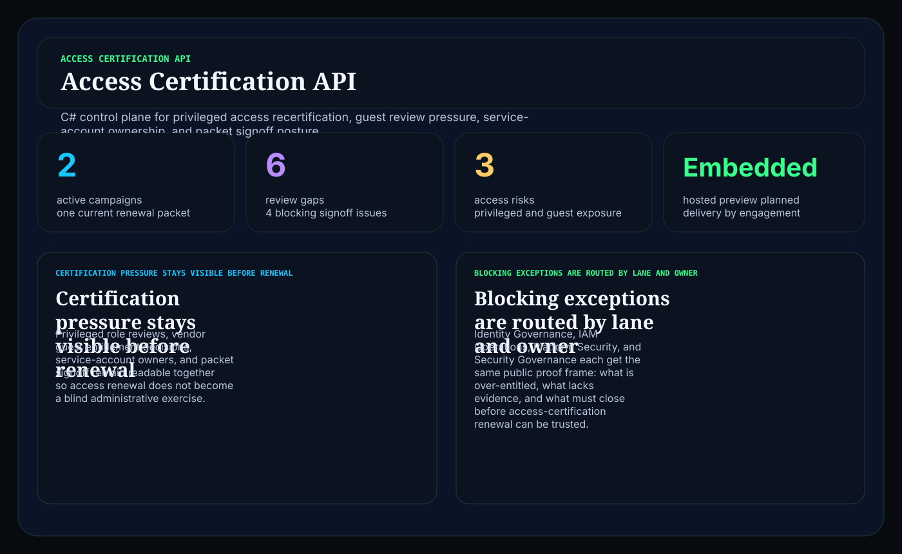
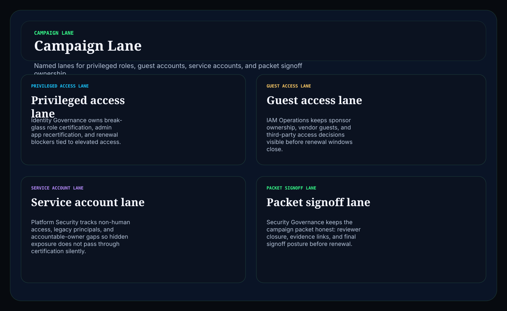
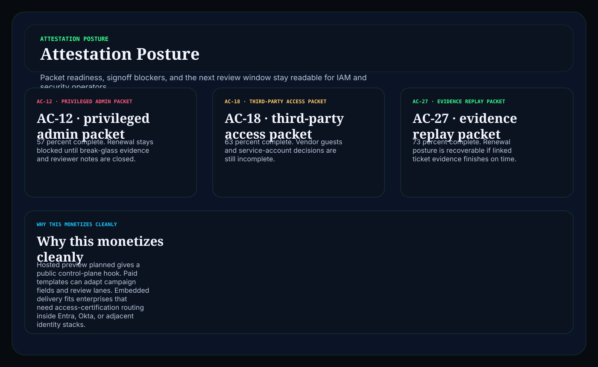

# access-certification-api-dotnet

C# / ASP.NET operator surface for routing privileged access reviews, guest entitlement renewals, service-account accountability, and attestation packet signoff into one readable control plane.

## Why this matters

Identity teams do not need another vague governance landing page. They need a board that keeps privileged roles, third-party guests, service accounts, reviewer cadence, and renewal signoff visible together before weak access decisions become silent entitlement debt.

This repo is the public proof surface for that pattern:

- `Hosted preview planned` for a browser-based access certification control plane
- `Embedded by engagement` for teams that need the routing model inside Entra, Okta, or adjacent identity-governance workflows

## What it includes

- ASP.NET Core minimal API in C#
- synthetic access-certification campaigns, review gaps, and attestation packets
- operator surfaces for:
  - `/campaign-lane`
  - `/review-exceptions`
  - `/attestation-posture`
  - `/verification`
  - `/docs`
- structured JSON endpoints under `/api/*`
- static Pages export with `robots.txt`, `sitemap.xml`, and `CNAME`

## Screenshots





## Verification

- synthetic access-certification and entitlement evidence only
- no tenant, user, or privileged production secrets
- no claim of SOC 2, ISO 27001, FedRAMP, or compliance certification
- this is a control-plane proof surface for IAM workflow depth, not a compliance certification claim

## Local run

```powershell
dotnet test
dotnet run --project src/AccessCertificationApi.Api -- --demo
dotnet run --project src/AccessCertificationApi.Api
```

Then open:

- `http://127.0.0.1:5087/`
- `http://127.0.0.1:5087/campaign-lane`
- `http://127.0.0.1:5087/review-exceptions`
- `http://127.0.0.1:5087/attestation-posture`

## Render static site

```powershell
dotnet run --project src/AccessCertificationApi.Api -- --prerender
```

## Related docs

- [Embedded framing](./docs/KINETIC_GAIN_EMBEDDED.md)
- [Origin story](./docs/ORIGIN.md)
